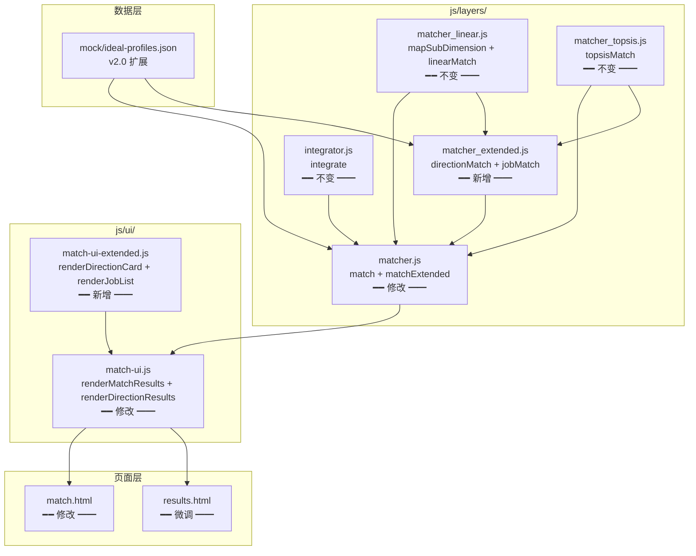
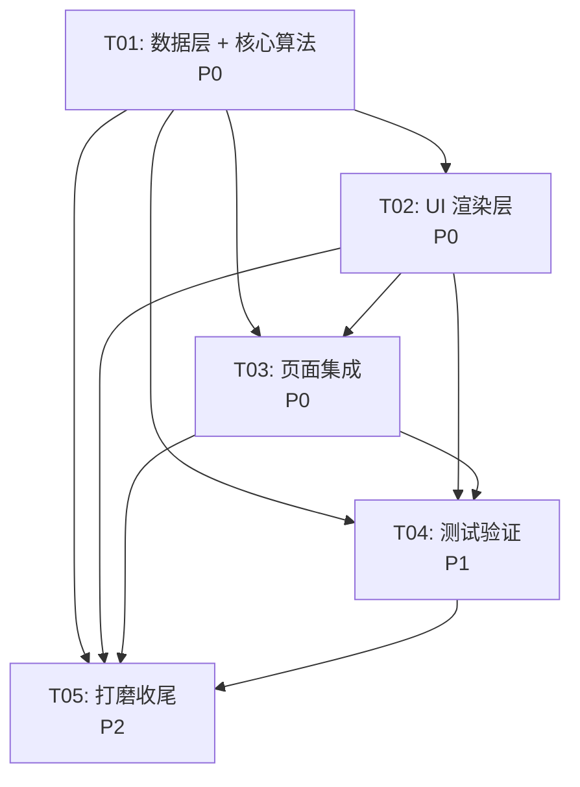

# MindMatch 匹配系统架构设计 — 6 方向 × 54 职业两级匹配

> 版本: v2.0 | 日期: 2026-05-31 | 作者: Bob (Architect)
> 基于: 当前匹配系统 (4 岗位扁平匹配) → 扩展为 6 方向 × 9 职业两级匹配
> 技术栈: 纯 HTML/CSS/JS + ES Modules，零构建，Python http.server 本地开发

---

## 目录

- [一、扩展数据 Schema](#一扩展数据-schema)
- [二、模块架构](#二模块架构)
- [三、接口契约](#三接口契约)
- [四、数据流](#四数据流)
- [五、任务分解](#五任务分解)
- [六、文件清单](#六文件清单)
- [七、依赖包列表](#七依赖包列表)
- [八、待明确事项](#八待明确事项)

---

## 一、扩展数据 Schema

### 1.1 `ideal-profiles.json` 新结构总览

```json
{
  "_comment": "v2.0 — 6 方向 × 54 职业两级匹配数据结构。值域 [0,1]，方向字段为 high/mid/low。",
  "_version": "2.0.0",

  "directions": {
    "<directionId>": { /* DirectionProfile — 6 个方向的原型剖面 */ }
  },

  "directionJobs": {
    "<directionId>": [ /* JobVariant[] — 该方向下的具体职业 delta 偏移 */ ]
  },

  "jobs": {
    "<jobId>": { /* 保留 v1 兼容 — 4 个原始岗位 */ }
  }
}
```

### 1.2 `DirectionProfile` — 方向原型剖面

方向 = 完整的 14 维理想剖面，是匹配引擎第一级的"正理想解"。

```json
{
  "id": "system-builder",
  "name": "系统建构者",
  "slogan": "用技术搭建未来",
  "description": "热衷于用技术手段搭建高效系统，在代码与架构中找到秩序与创造的交汇。",
  "icon": "🖥️",
  "gameWeights": { "G1": 0.20, "G2": 0.20, "G3": 0.35, "G4": 0.25 },
  "profiles": [
    { "field": "nAch",  "ideal": 0.75, "direction": "high", "weight": 0.35 },
    { "field": "nPow",  "ideal": 0.35, "direction": "low",  "weight": 0.15 },
    { "field": "nAff",  "ideal": 0.30, "direction": "low",  "weight": 0.10 },
    { "field": "TF",    "ideal": 0.90, "direction": "high", "weight": 0.30 },
    { "field": "GM",    "ideal": 0.50, "direction": "mid",  "weight": 0.10 },
    { "field": "AU",    "ideal": 0.65, "direction": "high", "weight": 0.20 },
    { "field": "SE",    "ideal": 0.55, "direction": "mid",  "weight": 0.08 },
    { "field": "EC",    "ideal": 0.50, "direction": "mid",  "weight": 0.10 },
    { "field": "SV",    "ideal": 0.25, "direction": "low",  "weight": 0.05 },
    { "field": "CH",    "ideal": 0.70, "direction": "high", "weight": 0.18 },
    { "field": "LS",    "ideal": 0.50, "direction": "mid",  "weight": 0.10 },
    { "field": "wholistAnalytic", "ideal": 0.85, "direction": "high", "weight": 1.00 },
    { "field": "presence",       "ideal": 0.30, "direction": "low",  "weight": 0.40 },
    { "field": "search",         "ideal": 0.70, "direction": "high", "weight": 0.60 }
  ]
}
```

**字段约束：**

| 字段 | 类型 | 约束 |
|------|------|------|
| `id` | `string` | 唯一标识，kebab-case，如 `system-builder` |
| `name` | `string` | 中文方向名，≤ 6 字 |
| `slogan` | `string` | ≤ 10 字 |
| `description` | `string` | ≤ 80 字 |
| `icon` | `string` | 单个 emoji |
| `gameWeights` | `{G1:number, G2:number, G3:number, G4:number}` | 四个值求和 = 1.0 |
| `profiles[].field` | `string` | 必须是 14 维之一 |
| `profiles[].ideal` | `number` | [0, 1] |
| `profiles[].direction` | `"high" \| "mid" \| "low"` | 期望方向 |
| `profiles[].weight` | `number` | (0, 1]，同方向内 weights 不强制求和=1 |

### 1.3 `JobVariant` — 职业变体（delta 建模）

具体职业 = 方向基线（DirectionProfile.profiles[].ideal） + delta 偏移。

```json
{
  "id": "software-engineer",
  "name": "软件工程师",
  "directionId": "system-builder",
  "icon": "💻",
  "description": "设计、开发、测试和维护软件系统，将需求转化为可运行的代码。",
  "delta": {
    "nAch": 0.00,
    "nPow": 0.00,
    "nAff": 0.05,
    "TF": 0.05,
    "GM": 0.00,
    "AU": 0.05,
    "SE": -0.05,
    "EC": 0.00,
    "SV": 0.00,
    "CH": 0.00,
    "LS": 0.00,
    "wholistAnalytic": 0.05,
    "presence": 0.00,
    "search": 0.00
  }
}
```

**delta 合并规则：**

```js
// 职业的实际 ideal = 方向 baseline + delta（clamped 到 [0, 1]）
function resolveJobIdeal(directionProfile, jobVariant) {
  return directionProfile.profiles.map(pf => {
    const delta = jobVariant.delta[pf.field] || 0;
    const adjustedIdeal = Math.max(0, Math.min(1, pf.ideal + delta));
    return { ...pf, ideal: adjustedIdeal };
  });
}
```

**delta 约束：**
- 每个 delta 值 ∈ [-0.20, +0.20]
- 只修改对职业区分度最高的 2-4 个维度
- 其余维度 delta = 0.00（与方向基线完全一致）
- direction 和 weight 从方向原型继承，职业不覆盖

### 1.4 保留 `jobs` — v1 兼容

```json
{
  "jobs": {
    "communication": { /* 原 communication 剖面 — 保持不变 */ },
    "creative":      { /* 原 creative 剖面 — 保持不变 */ },
    "analytical":    { /* 原 analytical 剖面 — 保持不变 */ },
    "technical":     { /* 原 technical 剖面 — 保持不变 */ }
  }
}
```

**兼容策略：** `match()` 函数读取 `jobs`（4 岗位），`matchExtended()` 读取 `directions` + `directionJobs`。两者互不干扰，`match.html` 通过 URL 参数 `?mode=extended` 切换模式。

### 1.5 完整 6 方向 ID 清单

| ID | 中文名 | Icon | 职业数 |
|----|--------|------|:-----:|
| `system-builder` | 系统建构者 | 🖥️ | 9 |
| `deep-reader` | 深度解读者 | 🔬 | 9 |
| `creative-molder` | 创意塑造者 | 🎨 | 9 |
| `people-connector` | 人际联结者 | 🤝 | 9 |
| `value-driver` | 价值驱动者 | 🚀 | 9 |
| `empowerment-companion` | 赋能陪伴者 | 🌱 | 9 |

### 1.6 14 维 field 名称常量

```js
const ALL_DIMS = [
  'nAch', 'nPow', 'nAff',          // G1: 核心驱动力
  'TF', 'GM', 'AU', 'SE',          // G2: 职业锚点 (前4)
  'EC', 'SV', 'CH', 'LS',          // G2: 职业锚点 (后4)
  'wholistAnalytic',                // G3: 认知风格
  'presence', 'search'              // G4: 意义建构
];
```

---

## 二、模块架构

### 2.1 模块依赖图



### 2.2 模块职责矩阵

| 模块 | 状态 | 职责 | 关键函数 |
|------|:---:|------|---------|
| `mock/ideal-profiles.json` | **修改** | 6 方向 + 54 职业数据结构 | 纯数据 |
| `js/layers/matcher_linear.js` | **不变** | 线性加权引擎 | `linearMatch()`, `mapSubDimension()`, `gameLevelBreakdown()` |
| `js/layers/matcher_topsis.js` | **不变** | TOPSIS 引擎 | `topsisMatch()`, `needsAIReview()` |
| `js/layers/matcher_extended.js` | **新增** | 方向级 + 职业级匹配逻辑 | `directionMatch()`, `jobMatch()` |
| `js/layers/matcher.js` | **修改** | 主编排器，新增扩展入口 | `match()`, `matchExtended()` |
| `js/ui/match-ui-extended.js` | **新增** | 方向结果渲染 | `renderDirectionResults()`, `renderDirectionCard()`, `renderJobList()` |
| `js/ui/match-ui.js` | **修改** | 原有渲染 + 新增渲染桥接 | `renderMatchResults()`, 导出辅助函数 |
| `css/match.css` | **修改** | 新增方向卡片 + 职业列表样式 | 纯 CSS |
| `match.html` | **修改** | 支持 `?mode=extended` 参数 | HTML |
| `results.html` | **微调** | 匹配入口文字调整 | HTML |

---

## 三、接口契约

以下使用 JSDoc/TypeScript 风格定义所有接口。JavaScript 实现通过 JSDoc 注释获得类型提示。

### 3.1 输入类型（不变）

```typescript
/** integrator.js 输出 — 不修改 */
interface UnifiedProfile {
  userId: string;
  generatedAt: number;            // timestamp ms
  dimensions: Record<DimensionId, number | null>;  // 14 维 [0,1]
  raw: Record<DimensionId, number | null>;
  meta: {
    totalDuration: number;
    completedGames: string[];
    completedCount: number;
    allCompleted: boolean;
  };
}

type DimensionId = 'nAch' | 'nPow' | 'nAff'
  | 'TF' | 'GM' | 'AU' | 'SE' | 'EC' | 'SV' | 'CH' | 'LS'
  | 'wholistAnalytic' | 'presence' | 'search';
```

### 3.2 数据模型类型

```typescript
/** 单个维度的剖面定义 */
interface ProfileEntry {
  field: DimensionId;
  ideal: number;           // [0, 1]
  direction: 'high' | 'mid' | 'low';
  weight: number;           // (0, 1]
}

/** 方向原型剖面（6 个中的 1 个） */
interface DirectionProfile {
  id: string;              // e.g. "system-builder"
  name: string;
  slogan: string;
  description: string;
  icon: string;            // emoji
  gameWeights: Record<'G1'|'G2'|'G3'|'G4', number>;
  profiles: ProfileEntry[];
}

/** 职业变体（在方向基线之上的 delta） */
interface JobVariant {
  id: string;              // e.g. "software-engineer"
  name: string;
  directionId: string;
  icon: string;
  description: string;
  delta: Partial<Record<DimensionId, number>>;  // [-0.20, +0.20]
}

/** 方向匹配的完整数据集合 */
interface DirectionDataSet {
  directions: Record<string, DirectionProfile>;
  directionJobs: Record<string, JobVariant[]>;
  jobs?: Record<string, any>;  // v1 兼容
}
```

### 3.3 匹配结果类型

```typescript
/** 一级：方向匹配结果（单条） */
interface DirectionMatchEntry {
  directionId: string;
  directionName: string;
  directionIcon: string;
  directionSlogan: string;
  directionDescription: string;
  /** 该方向内 (线性+TOPSIS) 融合得分 [0,100] */
  score: number;
  /** TOPSIS 贴近度 [0,1] */
  topsisCloseness: number;
  /** TOPSIS 排名 (1-6) */
  topsisRank: number;
  /** 线性加权原始得分 [0,100] */
  linearScore: number;
  /** G1-G4 游戏级分解 */
  breakdown: Record<'G1'|'G2'|'G3'|'G4', number>;
  /** 该方向下的职业匹配结果（仅 top1 方向有值） */
  jobResults?: JobMatchEntry[];
}

/** 二级：具体职业匹配结果（单条） */
interface JobMatchEntry {
  jobId: string;
  jobName: string;
  jobIcon: string;
  jobDescription: string;
  /** 综合得分 [0,100] */
  score: number;
  /** TOPSIS 贴近度 [0,1] */
  topsisCloseness: number;
  /** 在该方向内部 TOPSIS 排名 (1-9) */
  internalRank: number;
  /** 线性加权原始得分 [0,100] */
  linearScore: number;
  /** G1-G4 游戏级分解 */
  breakdown: Record<'G1'|'G2'|'G3'|'G4', number>;
  /** delta 叠加后的剖面（调试用） */
  _resolvedProfiles?: ProfileEntry[];
}

/** 扩展匹配的完整报告 */
interface ExtendedMatchReport {
  profile: UnifiedProfile;
  /** 6 方向排名（从高到低） */
  directionRanking: DirectionMatchEntry[];
  /** 双轨原始数据（调试用） */
  tracks: {
    linear: Array<{ directionId: string; score: number }>;
    topsis: Array<{ directionId: string; closeness: number; rank: number }>;
  };
  /** 是否需要 AI 审核 */
  needsAIReview: boolean;
  generatedAt: number;
}

/** v1 兼容 — MatchReport（不变） */
interface MatchReport {
  profile: UnifiedProfile;
  ranking: Array<{...}>;
  tracks: { linear: any[]; topsis: any[] };
  needsAIReview: boolean;
  generatedAt: number;
}
```

### 3.4 核心函数签名

```typescript
// ========== js/layers/matcher_extended.js（新增）==========

/**
 * 一级匹配：将用户与 6 个方向原型匹配
 * @returns 方向匹配排名数组（按 score 降序）
 */
function directionMatch(
  profile: UnifiedProfile,
  directions: Record<string, DirectionProfile>
): DirectionMatchEntry[];

/**
 * 二级匹配：将用户与指定方向内的具体职业匹配
 * @param directionProfile — 方向原型剖面（提供 baseline）
 * @param jobVariants — 该方向下的职业变体列表
 * @returns 职业匹配排名数组（按 score 降序）
 */
function jobMatch(
  profile: UnifiedProfile,
  directionProfile: DirectionProfile,
  jobVariants: JobVariant[]
): JobMatchEntry[];

/**
 * 将方向基线 + 职业 delta 合并为完整剖面
 * @internal
 */
function resolveJobProfile(
  directionProfile: DirectionProfile,
  jobVariant: JobVariant
): DirectionProfile;  // 合并后的完整剖面（结构与 DirectionProfile 一致）


// ========== js/layers/matcher.js（修改：新增 matchExtended）==========

/**
 * 主编排器：两级匹配 → 输出扩展报告
 * @param data — 来自 ideal-profiles.json（含 directions + directionJobs）
 */
function matchExtended(
  profile: UnifiedProfile,
  data: DirectionDataSet
): ExtendedMatchReport;

/** v1 兼容 — 不变 */
function match(profile: UnifiedProfile, jobs: object): MatchReport;


// ========== js/ui/match-ui-extended.js（新增）==========

/**
 * 渲染方向匹配结果（两级展开模式）
 * @param report — matchExtended() 的输出
 */
function renderDirectionResults(
  containerId: string,
  report: ExtendedMatchReport
): void;

/**
 * 渲染单个方向排名卡片
 * @param entry — 单个方向匹配条目
 * @param rank — 排名 (1-based)
 * @param isExpanded — 是否展开显示职业列表（仅 top1 为 true）
 */
function renderDirectionCard(
  entry: DirectionMatchEntry,
  rank: number,
  isExpanded: boolean
): HTMLElement;

/**
 * 渲染职业列表（在 top1 方向卡片内）
 * @param jobResults — 该方向下已排序的职业匹配结果
 */
function renderJobList(
  jobResults: JobMatchEntry[]
): HTMLElement;
```

### 3.5 算法核心约定

```
mapSubDimension(actual, direction) → [0, 1]
  direction='high' → actual≥0.7→1.0, 0.4-0.7→线性, <0.4→0
  direction='low'  → actual≤0.3→1.0, 0.3-0.6→线性, >0.6→0
  direction='mid'  → 1 - |actual-0.5|×2.5 (三角分布)
  ━━ 不变，两级匹配共用 ━━

directionMatch: linearMatch + topsisMatch → 6 方向融合排名 → DirectionMatchEntry[]
  ━━ 复用 matcher_linear.linearMatch() + matcher_topsis.topsisMatch() ━━

jobMatch(profile, directionProfile, jobVariants):
  对每个 jobVariant:
    resolved = resolveJobProfile(directionProfile, jobVariant)
    // resolved 是一个结构上与 DirectionProfile 一致的完整剖面
    linearScore = linearScoreForJob(profile.dimensions, resolved)
  按 score 降序排列 → JobMatchEntry[]
  ━━ 使用 matcher_linear.linearScoreForJob() (internal) 或等价逻辑 ━━
```

---

## 四、数据流

### 4.1 完整数据流时序图

```mermaid
sequenceDiagram
    actor User as 用户
    participant MatchHTML as match.html
    participant Integrator as integrator.js
    participant Store as store.js
    participant Matcher as matcher.js
    participant MatcherExt as matcher_extended.js
    participant Linear as matcher_linear.js
    participant Topsis as matcher_topsis.js
    participant UI as match-ui-extended.js
    participant DOM as 浏览器 DOM

    User->>MatchHTML: 访问 match.html?mode=extended
    MatchHTML->>Integrator: integrate()
    Integrator->>Store: loadAll()
    Store-->>Integrator: G1-G4 游戏数据
    Integrator-->>MatchHTML: UnifiedProfile (14维 [0,1])

    MatchHTML->>MatchHTML: fetch('./mock/ideal-profiles.json')
    MatchHTML-->>MatchHTML: DirectionDataSet {directions, directionJobs}

    MatchHTML->>Matcher: matchExtended(profile, data)

    rect rgb(40, 40, 70)
        Note over Matcher,MatcherExt: === 第一级：6 方向匹配 ===

        Matcher->>MatcherExt: directionMatch(profile, data.directions)
        MatcherExt->>Linear: linearMatch(profile, directions)
        Linear-->>MatcherExt: [{directionId, score, dimDetails} ×6]
        MatcherExt->>Topsis: topsisMatch(profile, directions)
        Topsis-->>MatcherExt: [{directionId, closeness, dPlus, dMinus} ×6]
        MatcherExt-->>Matcher: DirectionMatchEntry[] (6条，按score降序)
    end

    rect rgb(40, 70, 40)
        Note over Matcher,MatcherExt: === 第二级：top1 方向内的职业匹配 ===

        Matcher->>MatcherExt: jobMatch(profile, topDirection, jobVariants)
        loop 对每个 jobVariant (共9个)
            MatcherExt->>MatcherExt: resolveJobProfile(directionBaseline, jobDelta)
            MatcherExt->>Linear: linearScoreForJob(userDims, resolvedProfile)
            Linear-->>MatcherExt: {jobId, score, dimDetails}
        end
        MatcherExt-->>Matcher: JobMatchEntry[] (9条，按score降序)
    end

    Matcher-->>MatchHTML: ExtendedMatchReport

    MatchHTML->>UI: renderDirectionResults('matchContent', report)
    UI->>DOM: 渲染 6 张方向卡片
    UI->>DOM: top1 方向展开显示 9 职业列表
    UI->>DOM: 其余方向折叠显示 "查看详情 ▼"

    User->>DOM: 点击折叠方向 "查看详情 ▼"
    DOM->>UI: toggle事件 → Lazy jobMatch
    UI->>MatcherExt: jobMatch(profile, clickedDirection, jobVariants)
    MatcherExt-->>UI: JobMatchEntry[]
    UI->>DOM: 展开显示该方向的 9 职业列表
```



### 4.2 方向卡片折叠/展开交互

```
初始渲染:
  ┌──────────────────────────────────────────┐
  │ 🏆 #1 系统建构者  用技术搭建未来  82%     │  ← 展开
  │ ┌──────────────────────────────────────┐ │
  │ │ 职业匹配:                            │ │
  │ │ ① 软件工程师  88%  ████████░        │ │
  │ │ ② 系统架构师  85%  ████████░        │ │
  │ │ ③ AI/算法工程师 80%  ████████       │ │
  │ │ ...                                  │ │
  │ └──────────────────────────────────────┘ │
  ├──────────────────────────────────────────┤
  │ #2 深度解读者  用分析洞察本质  74%    ▼  │  ← 折叠
  ├──────────────────────────────────────────┤
  │ #3 创意塑造者  用创意改变表达  61%    ▼  │  ← 折叠
  ├──────────────────────────────────────────┤
  │ ...                                      │
  └──────────────────────────────────────────┘

点击 #2 折叠卡片 "▼" 后:
  ┌──────────────────────────────────────────┐
  │ #2 深度解读者  用分析洞察本质  74%    ▲  │  ← 展开
  │ ┌──────────────────────────────────────┐ │
  │ │ 职业匹配:                            │ │
  │ │ ① 金融分析师  78%  ███████░         │ │
  │ │ ② 研究员/学者  75%  ███████░        │ │
  │ │ ...                                  │ │
  │ └──────────────────────────────────────┘ │
  ├──────────────────────────────────────────┤
  │ #3 创意塑造者  用创意改变表达  61%    ▼  │  ← 恢复折叠
```

---

## 五、任务分解

### 5.1 Required Packages

```
无新增外部依赖。
```

- 核心技术栈不变：纯 HTML/CSS/JS + ES Modules
- CSS 变量体系 (`base.css`) 不变
- 零新 npm 包、零新 CDN 引入

### 5.2 任务列表

#### T01: 数据层 — ideal-profiles.json 扩展 + 核心匹配算法

| 属性 | 内容 |
|------|------|
| **Task ID** | T01 |
| **Task Name** | 数据层扩展 + 核心匹配算法实现 |
| **Status** | pending |
| **Priority** | P0 |
| **Dependencies** | 无 |
| **Source Files** | `mock/ideal-profiles.json` (重大修改), `js/layers/matcher_extended.js` (新增), `js/layers/matcher.js` (修改: 新增 matchExtended) |
| **Description** | 1. 重构 `ideal-profiles.json` 为 v2.0 结构，新增 `directions` (6个完整剖面) + `directionJobs` (54个职业 delta) + 保留 `jobs` (v1兼容)。2. 新建 `matcher_extended.js` 实现 `directionMatch()`, `jobMatch()`, `resolveJobProfile()` 三个核心函数。3. 修改 `matcher.js` 新增 `matchExtended()` 主编排函数，保持 `match()` 不变。 |

**详细子任务：**

1. **`mock/ideal-profiles.json`** — 完整重写
   - 新增 `"directions"` 对象：6 个 DirectionProfile，每个包含完整 14 维 profiles + gameWeights
   - 新增 `"directionJobs"` 对象：6 个 key，每个包含 9 个 JobVariant（含 delta）
   - 保留 `"jobs"` 对象：原 4 岗位数据不变
   - 更新 `_comment` 和 `_version` 字段
   - 数据来源：职业匹配扩展方案.md 中的 6 方向剖面数据 + 54 职业 delta

2. **`js/layers/matcher_extended.js`** — 新建
   - 实现 `directionMatch(profile, directions)`:
     - 调用 `linearMatch(profile, directions)` 获取线性得分
     - 调用 `topsisMatch(profile, directions)` 获取 TOPSIS 贴近度
     - 调用 `gameLevelBreakdown(userProfile, directionProfile)` 逐方向获取 G1-G4 分解
     - 融合结果：TOPSIS 定排名，线性定 score
     - 返回 `DirectionMatchEntry[]`
   - 实现 `jobMatch(profile, directionProfile, jobVariants)`:
     - 遍历 jobVariants，调用 `resolveJobProfile()` 合并基线+delta
     - 对每个合并后剖面调用线性匹配（复用 `matcher_linear` 内部逻辑）
     - 返回 `JobMatchEntry[]`
   - 实现 `resolveJobProfile(directionProfile, jobVariant)`:
     - 浅拷贝 profiles 数组
     - 叠加 delta：`ideal = clamp(originalIdeal + delta, 0, 1)`
     - direction 和 weight 从方向原型继承
     - 返回结构与 DirectionProfile 一致的完整剖面对象

3. **`js/layers/matcher.js`** — 修改
   - 新增 `matchExtended(profile, data)` 函数：
     - Step 1: 调用 `directionMatch(profile, data.directions)` 获取 6 方向排名
     - Step 2: 取 top1 方向，调用 `jobMatch(profile, topDirection, data.directionJobs[topDirection.id])` 获取职业排名
     - Step 3: 将 jobResults 附加到 top1 的 DirectionMatchEntry 上
     - Step 4: 检查是否需要 AI 审核（复用 `needsAIReview`）
     - Step 5: 返回 `ExtendedMatchReport`
   - 更新 import：引入 `directionMatch`, `jobMatch` from `matcher_extended.js`
   - `match()` 函数保持不变

**预估复杂度：中高 (6-8h)**
- ideal-profiles.json 数据录入工作量大（54 职业 delta）
- matcher_extended.js 核心逻辑中等（约 150 行）
- matcher.js 修改量小（约 40 行新增）

---

#### T02: 渲染层 — 方向结果 UI + CSS

| 属性 | 内容 |
|------|------|
| **Task ID** | T02 |
| **Task Name** | 方向结果渲染 UI 实现 |
| **Status** | pending |
| **Priority** | P0 |
| **Dependencies** | T01 |
| **Source Files** | `js/ui/match-ui-extended.js` (新增), `js/ui/match-ui.js` (修改: 导出辅助函数), `css/match.css` (修改: 新增方向卡片+职业列表样式) |
| **Description** | 实现方向卡片 + 职业列表的 DOM 渲染逻辑。复用 match-ui.js 中的纯展示辅助函数（createEl, getRankColor, getGameColor, getGameLabel）。 |

**详细子任务：**

1. **`js/ui/match-ui-extended.js`** — 新建
   - 实现 `renderDirectionResults(containerId, report)`:
     - 清空容器，添加 header
     - 遍历 `report.directionRanking`，对 rank=1 展开，其余折叠
     - 添加方法论说明 footer
   - 实现 `renderDirectionCard(entry, rank, isExpanded)`:
     - 与现有 `buildJobCard` 类似但适配 DirectionMatchEntry
     - 包含：排名徽标、icon、方向名、slogan、描述、匹配度圆环、G1-G4 分解条、TOPSIS/线性元数据
     - `isExpanded=true` 时追加职业列表容器 `renderJobList(entry.jobResults)`
     - `isExpanded=false` 时追加 "查看职业详情 ▼" 折叠按钮
   - 实现 `renderJobList(jobResults)`:
     - 简洁的职业横向列表（或紧凑纵向）
     - 每项显示：排名、职业名、得分条、简短描述
   - 实现折叠/展开 toggle 逻辑：
     - 点击折叠按钮 → 触发该方向的 `jobMatch()` 懒加载（如果尚未加载）
     - 渲染完成后切换按钮文案 "▲收起"
   - 错误处理：try-catch 包裹，渲染失败时显示错误占位符

2. **`js/ui/match-ui.js`** — 修改（轻量）
   - 将纯展示辅助函数导出供 `match-ui-extended.js` 复用：
     - `export { getRankColor, getGameColor, getGameLabel, createEl }`
   - 将 `buildJobCard` 中的副函数（getRankColor 等）提升为命名导出
   - 保持 `renderMatchResults` 默认导出不变

3. **`css/match.css`** — 修改（新增约 120 行）
   - 新增 `.match-direction-card` 样式（方向卡片，与现有 `.match-card` 类似但适配两级结构）
   - 新增 `.match-direction-card--expanded` 展开态样式
   - 新增 `.match-job-list` 职业列表容器样式
   - 新增 `.match-job-item` 单个职业条目样式（紧凑版 `.match-card`）
   - 新增 `.match-job-item-bar` 简版得分条
   - 新增 `.match-toggle-btn` 折叠按钮样式
   - 新增 `.match-expanded-section` 展开区域动画（max-height transition）

**预估复杂度：中 (5-6h)**
- match-ui-extended.js 约 250-300 行
- match-ui.js 修改量小（约 20 行）
- CSS 约 120 行新增

---

#### T03: 页面集成 — match.html 模式切换

| 属性 | 内容 |
|------|------|
| **Task ID** | T03 |
| **Task Name** | match.html 页面集成 + 模式切换 |
| **Status** | pending |
| **Priority** | P0 |
| **Dependencies** | T01, T02 |
| **Source Files** | `match.html` (修改), `results.html` (微调), `index.html` (可选微调) |
| **Description** | 在 match.html 中集成扩展匹配模式，通过 URL 参数 `?mode=extended` 切换。同时调整 results.html 的入口链接。 |

**详细子任务：**

1. **`match.html`** — 修改
   - 读取 `URLSearchParams`：`const mode = new URLSearchParams(location.search).get('mode') || 'v1'`
   - `mode === 'extended'` 时：
     - 加载 `matcher_extended.js`
     - 标题改为 "职业方向匹配"
     - 调用 `matchExtended(profile, data)` → `renderDirectionResults()`
   - `mode === 'v1'`（默认）时：
     - 保持原有行为：`match(profile, jobs)` → `renderMatchResults()`
   - 新增模式切换按钮（UI 层面）：页面顶部 mini tab "岗位匹配 | 方向匹配"
   - 错误处理：fetch ideal-profiles.json 失败时检查 `directions` 字段是否存在

2. **`results.html`** — 微调
   - 匹配入口链接从 `match.html` 改为 `match.html?mode=extended`
   - 入口文案从 "查看岗位匹配" 改为 "查看职业方向匹配"
   - 保留原有 `match.html` 作为备选（在高级设置中或开发者模式可见）

3. **`index.html`** — 可选微调
   - 如首页有匹配入口，同步更新链接

**预估复杂度：低 (2-3h)**
- match.html 约 30 行修改
- results.html 约 5 行修改

---

#### T04: 测试验证 — 合成数据 + 自动化测试

| 属性 | 内容 |
|------|------|
| **Task ID** | T04 |
| **Task Name** | 合成数据集扩展 + 匹配测试 |
| **Status** | pending |
| **Priority** | P1 |
| **Dependencies** | T01, T02, T03 |
| **Source Files** | `mock/synthetic-users.json` (修改: 新增扩展测试用户), `test/test-match-extended.html` (新增), `test/test-matcher-node.js` (修改: 新增扩展匹配测试) |
| **Description** | 扩展合成数据集覆盖 6 方向场景，编写浏览器和 Node.js 双环境测试用例，验证两级匹配的正确性。 |

**详细子任务：**

1. **`mock/synthetic-users.json`** — 修改
   - 新增 6 个"清晰方向型"虚拟用户（每个方向一个完美匹配）
   - 新增 3 个"混合型"（跨方向混合）
   - 新增 2 个"极端型"（全 0、全 1）
   - 标注 `expectedTopDirection` 用于自动化验证

2. **`test/test-match-extended.html`** — 新建
   - 独立测试页，加载 matcher_extended.js + ideal-profiles.json
   - 加载 synthetic-users.json 中的 11 个测试用户
   - 对每个用户运行 `matchExtended()`，验证 `directionRanking[0].directionId === expectedTopDirection`
   - 输出测试报告：通过数/失败数/详情
   - 控制台输出每个用户的完整 ExtendedMatchReport 供人工审查

3. **`test/test-matcher-node.js`** — 修改
   - 新增 `testExtendedMatching()` 函数
   - 验证 `resolveJobProfile()` 的 delta 合并正确性（单元测试）
   - 验证 `jobMatch()` 返回 9 条结果且排序正确
   - 验证全部 6 个方向的 jobMatch 都能正常工作

**预估复杂度：中 (4-5h)**
- 合成数据编制约 2h
- 测试脚本约 2h

---

#### T05: 打磨收尾 — 错误处理 + 边界情况 + 代码清理

| 属性 | 内容 |
|------|------|
| **Task ID** | T05 |
| **Task Name** | 错误处理、边界情况、文档更新 |
| **Status** | pending |
| **Priority** | P2 |
| **Dependencies** | T01, T02, T03, T04 |
| **Source Files** | `js/layers/matcher_extended.js` (修改: 边界处理), `js/ui/match-ui-extended.js` (修改: 空状态), `match.html` (修改: 降级逻辑), `docs/匹配系统架构设计-2026-05-31.md` (本文档定稿) |
| **Description** | 处理所有异常路径、空状态、降级场景。清理调试代码。更新项目文档。 |

**详细子任务：**

1. **`js/layers/matcher_extended.js`** — 边界处理
   - `directionMatch()`: 当 directions 为空对象时返回空数组（不抛异常）
   - `jobMatch()`: 当 jobVariants 为空数组时返回空数组
   - `resolveJobProfile()`: delta 不存在时返回方向原样
   - 用户维度为 null 时使用 0.5（中性值）作为 fallback

2. **`js/ui/match-ui-extended.js`** — 空状态处理
   - 无匹配结果时显示占位提示
   - jobResults 为空时显示 "暂无具体职业数据"
   - 懒加载失败时显示重试按钮

3. **`match.html`** — 降级逻辑
   - ideal-profiles.json 缺少 `directions` 字段时自动降级为 v1 模式
   - fetch 失败时显示明确错误信息
   - mode 参数无效值时默认 v1

4. **文档更新**
   - 本文档定稿归档
   - 更新 `迭代记录.md` 添加 v2.0 扩展记录

**预估复杂度：低 (2-4h)**

---

### 5.3 任务依赖图



### 5.4 任务概览表

| ID | 任务 | 文件数 | 复杂度 | 预估工时 | 依赖 |
|:--:|------|:-----:|:-----:|:------:|------|
| T01 | 数据层 + 核心算法 | 3 | 中高 | 6-8h | — |
| T02 | UI 渲染层 | 3 | 中 | 5-6h | T01 |
| T03 | 页面集成 | 3 | 低 | 2-3h | T01, T02 |
| T04 | 测试验证 | 3 | 中 | 4-5h | T01-T03 |
| T05 | 打磨收尾 | 4 | 低 | 2-4h | T01-T04 |

---

## 六、文件清单

### 6.1 新增文件

| 文件路径 | 用途 | 预估行数 |
|---------|------|:------:|
| `js/layers/matcher_extended.js` | 方向级 + 职业级匹配核心算法 | ~150 |
| `js/ui/match-ui-extended.js` | 方向结果 DOM 渲染 | ~280 |
| `test/test-match-extended.html` | 扩展匹配独立测试页 | ~120 |

### 6.2 修改文件

| 文件路径 | 改动类型 | 改动量 |
|---------|---------|:---:|
| `mock/ideal-profiles.json` | 重大重写 — 新增 directions + directionJobs + 保留 jobs | +400 行 |
| `js/layers/matcher.js` | 新增 matchExtended() + 更新 import | +45 行 |
| `js/ui/match-ui.js` | 导出辅助函数 (getRankColor 等) | ~20 行 |
| `css/match.css` | 新增方向卡片 + 职业列表 + 折叠按钮样式 | +130 行 |
| `match.html` | 支持 ?mode=extended 参数 + 模式切换 UI | ~40 行修改 |
| `results.html` | 入口链接更新 | ~5 行 |
| `mock/synthetic-users.json` | 新增扩展测试用户 | +80 行 |
| `test/test-matcher-node.js` | 新增扩展匹配测试函数 | +60 行 |

### 6.3 不变文件

| 文件 | 说明 |
|------|------|
| `js/layers/matcher_linear.js` | 线性引擎完全复用 |
| `js/layers/matcher_topsis.js` | TOPSIS 引擎完全复用 |
| `js/layers/integrator.js` | 数据整合不变 |
| `js/core/store.js` | 数据存储不变 |
| `js/core/utils.js` | 工具函数不变 |
| `css/base.css` | 基础样式不变 |
| `css/components.css` | 组件样式不变 |
| `css/results.css` | 结果页样式不变 |
| `index.html` | 首页不变 |
| `games/*` | 游戏层完全不变 |

---

## 七、依赖包列表

```
无新增依赖。
```

- **不引入**任何新的 JS 库、CDN 资源或 npm 包
- 纯 ES Modules，所有模块手动导入
- 开发环境：`python -m http.server 8080`（不变）
- 部署环境：腾讯云 CloudBase 静态托管（不变）

---

## 八、待明确事项

| # | 事项 | 影响范围 | 建议 |
|---|------|---------|------|
| 1 | **54 职业的 delta 值需要人工校准** — 当前方案中每个方向 9 个职业，每个职业的 delta 偏移值需要根据职业特性精准设定。理想值取决于对 O*NET 数据的映射和对中国职业市场的理解。 | `ideal-profiles.json` 数据质量 | 建议先不要求完美：每个职业设 2-3 个维度做 ±0.05~0.15 的微调，其余维度 delta=0.00。后续根据真实用户反馈迭代调整。 |
| 2 | **二级匹配是否使用 TOPSIS** — 当前设计是职业级匹配仅用线性加权（因为 9 个职业在同方向内，基线相同，变体差异小）。是否需要 TOPSIS 做职业内部的排位？ | `matcher_extended.js` | 当前方案：职业级仅线性匹配。如果后续发现同一方向内职业难以区分（得分过于接近），可考虑引入 TOPSIS。先保持简单。 |
| 3 | **折叠方向的懒加载时机** — 当前设计是除 top1 外其余方向折叠，点击时按需调用 `jobMatch()`。是否需要预加载 top2-top3 的职业结果？ | `match-ui-extended.js` | 建议只对 top1 预加载。top2-top6 点击时懒加载（用户主动操作说明他有兴趣）。 |
| 4 | **v1 兼容模式保留多久？** — `jobs` 字段和 `match()` 函数保留在代码中。 | `matcher.js`, `ideal-profiles.json` | 建议保留 v1 兼容至少到 v2 稳定运行一轮用户测试后（约 2 周）。届时可移除 v1 模式并清理代码。 |
| 5 | **6 方向的 icon 选择** — 当前草案中 6 个 icon 均为临时占位。 | `ideal-profiles.json` | 建议与设计/产品确认。当前草案：🖥️ 🔬 🎨 🤝 🚀 🌱。 |
| 6 | **扩展匹配是否需要 AI 审核？** — 当前 `needsAIReview` 检查的是 4 岗位的 top1 一致性。6 方向场景可能需要不同的阈值。 | `matcher.js` | 建议复用现有 `needsAIReview` 逻辑：6 个方向的 top1 如果线性与 TOPSIS 不一致，或 top1 TOPSIS 贴近度 < 0.6，则标记 `needsAIReview=true`。逻辑自然扩展，无需修改阈值。 |
| 7 | **results.html 是否需要展示方向匹配摘要？** — 当前 results.html 底部有一个 "查看岗位匹配" 入口按钮。扩展后是否在 results.html 中直接展示 top1 方向？ | `results.html` | 建议保持当前设计：results.html 只展示肖像 + AI 解读，底部入口跳转到独立的匹配页。匹配页空间更大，展示效果更好。 |

---

## 附录 A: 关键设计决策记录

| 决策 | 结论 | 理由 |
|------|------|------|
| **匹配引擎复用** | matcher_linear.js 和 matcher_topsis.js 完全不变 | `linearMatch()` 和 `topsisMatch()` 接口通用：`(profile, jobs)` → 接受任何符合 {id, profiles[], gameWeights} 结构的对象。DirectionProfile 天然满足此接口。 |
| **职业 delta 建模** | 方向基线 + delta 偏移，direction/weight 从方向继承 | 最小化数据冗余：54 个职业不需要各自复制完整的 14 维剖面。delta 只声明差异。 |
| **两级匹配融合** | TOPSIS 定排名，线性定 score（与 v1 一致） | 保持一致性。第一级用完整双轨，第二级仅线性（同级内差异小，TOPSIS 增益有限）。 |
| **折叠交互** | top1 展开，其余折叠，点击懒加载 | 减少初始渲染压力（从 54 条降到 6+9=15 条）。折叠卡片保留方向级信息，用户能判断是否需要展开。 |
| **URL 参数切换** | `?mode=extended` vs 默认 `?mode=v1` | 最小破坏性变更。v1 使用者不受影响。方便 A/B 对比测试。 |

---

## 附录 B: 实现检查清单

- [ ] T01: `ideal-profiles.json` 包含 6 个 `directions`、6 组 `directionJobs`（共 54 条）、保留 `jobs`
- [ ] T01: `matcher_extended.js` 导出 `directionMatch`, `jobMatch`, `resolveJobProfile`
- [ ] T01: `matcher.js` 导出 `matchExtended`，保持 `match` 不变
- [ ] T02: `match-ui-extended.js` 导出 `renderDirectionResults`
- [ ] T02: `match-ui.js` 导出 `getRankColor`, `getGameColor`, `getGameLabel`, `createEl`
- [ ] T02: `match.css` 新增约 130 行样式
- [ ] T03: `match.html?mode=extended` 正确加载扩展引擎并渲染
- [ ] T03: `results.html` 入口链接更新
- [ ] T04: 6 个"清晰方向型"合成用户各自匹配到预期 top1 方向
- [ ] T04: `resolveJobProfile()` 单元测试通过
- [ ] T05: 空状态 / 异常状态均有友好提示
- [ ] T05: v1 模式 (`match.html` 不带参数) 行为完全不变

---

*文档版本: v1.0 | 最后更新: 2026-05-31 | 作者: Bob (Architect)*
*下一阶段: 工程师(Cody)按 T01→T05 顺序实现*
